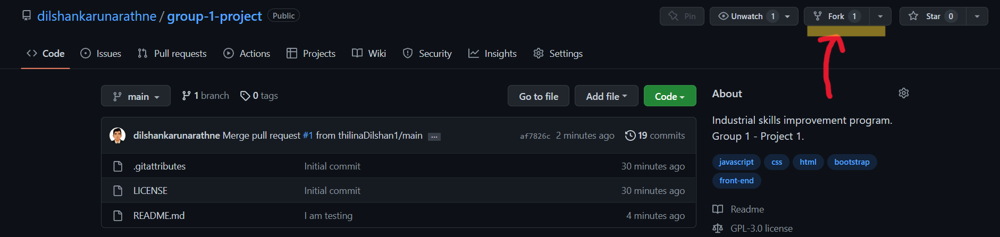
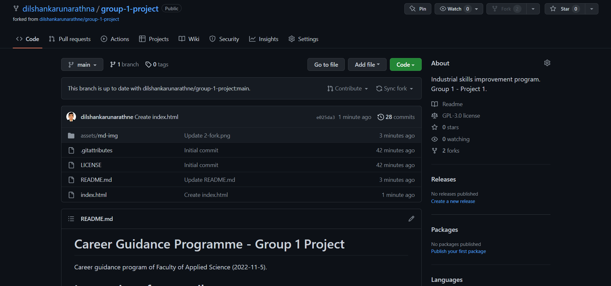
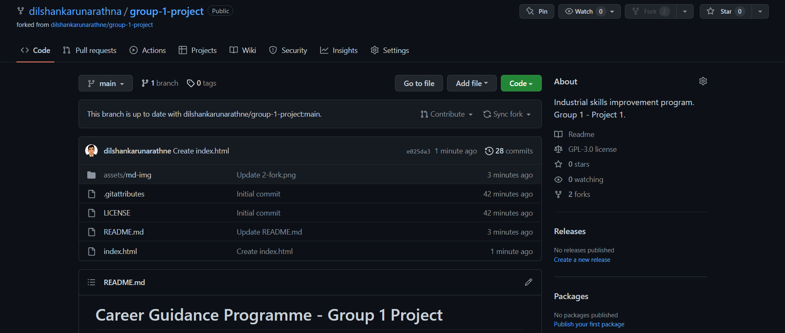
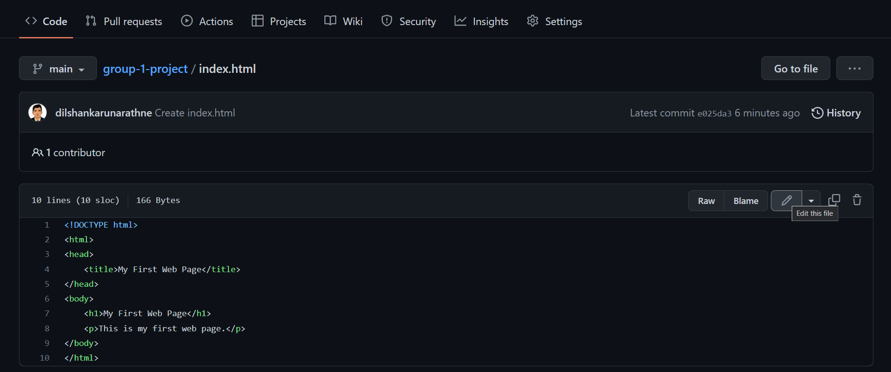
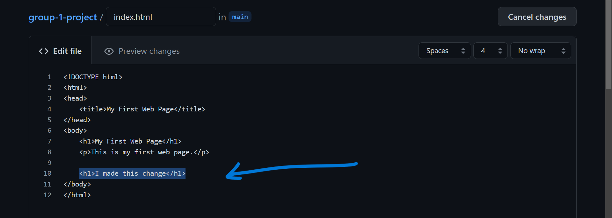

# Career Guidance Programme - Group 1 Project

Career guidance program of Faculty of Applied Science (2022-11-5).

# Instructions for contributors...

## Step 1 - Sign in
Log-in to your GitHub account.  
[Click Here to Sign-in](https://github.com/login)  
(Skip this step if you're already logged-in)

## Step 2 - Fork the repository
Fork this repository.  

1. Click on the Fork button on the top right corner of this page.  

2. You will be redirected to your forked repository.  
  
Click on **Create fork** button.

3. You will be redirected to your forked repository.   

## Step 3 - Edit the file

1. Click on any file to edit it.  

  
(I am editing the index.html file here for demonstration purposes)

2. Click on **Edit this file** button.  

3. Make the changes you want to make.  

4. Fill up the required information about the changes you just made.  
This is important, so make sure to give a proper description.  
And then click on **Commit changes** button.
 

still writing this doc... 😉

